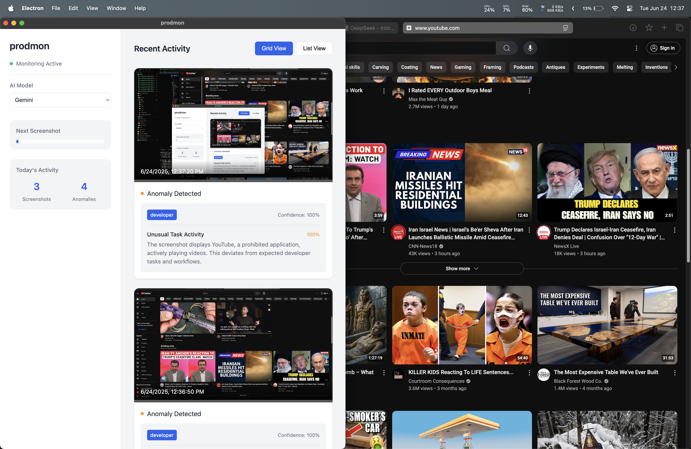

# prodmon

**prodmon** is a cross-platform desktop productivity monitoring application that uses AI to analyze user activity via periodic screenshots. It detects anomalies and deviations from role-based productivity baselines using both cloud (Google Gemini) and local (Gemma3 via Ollama) models.

## Features

- **Automated Screenshot Capture:** Takes desktop screenshots at regular intervals.
- **OCR Extraction:** Extracts text from screenshots using Tesseract OCR.
- **AI-Powered Anomaly Detection:** Analyzes extracted text for productivity anomalies using:
  - Google Gemini API (cloud)
  - Local Gemma3 model (via Ollama)
- **Role-Based Rules:** Supports customizable rules and baselines for different job roles (developer, accountant, office worker, etc.).
- **Learning System:** Detects unknown entities in screenshots and updates rules using LLMs.
- **Modern Electron Frontend:** Real-time dashboard for monitoring, anomaly alerts, and model selection.
- **Cross-Platform:** Works on Windows, macOS, and Linux.

## Screenshots


_example screenshot 1: prodmon flags YouTube as unproductive_

## Project Structure

```
prodmon/
  src/
    index.js         # Electron main process (app entry)
    index.html       # Frontend UI
    index.css        # Styles
    logic/
      requirements.txt
      src/
        main.py      # Python backend entry point
        api/
          gemini.py  # Google Gemini API integration
          gemma3.py  # Local Gemma3 model integration
        utils/
          ocr.py     # OCR extraction logic
          cli.py     # CLI argument parsing and debug
          learn.py   # Learning system for unknowns
      rules/
        baseline.json
        developer/baseline.json
        accountant/baseline.json
        office_worker/baseline.json
```

## Installation

### Prerequisites

- [Node.js](https://nodejs.org/) (for Electron)
- [Python 3.9+](https://www.python.org/)
- [Ollama](https://ollama.com/) (for local Gemma3 model, optional)
- [Tesseract OCR](https://github.com/tesseract-ocr/tesseract) installed and in your PATH

### Setup

1. **Clone the repository:**
   ```bash
   git clone <repo-url>
   cd prodmon
   ```

2. **Install Node dependencies:**
   ```bash
   npm install
   ```

3. **First run (auto-setup):**
   ```bash
   npm start
   ```
   - On first launch, the app will create a Python virtual environment and install backend dependencies automatically.

4. **Configure Google Gemini API (optional for cloud AI):**
   - Create a `.env` file in `src/logic/` with:
     ```
     GOOGLE_API_KEY=your_google_gemini_api_key
     ```

5. **(Optional) Setup Ollama and Gemma3 for local AI:**
   - Install [Ollama](https://ollama.com/) and pull the Gemma3 model:
     ```bash
     ollama pull gemma3:4b
     ```

## Usage

- Launch the app with `npm start`.
- The app will take screenshots every 30 seconds and analyze them.
- Switch between "Gemini" (cloud) and "Local Model" (Gemma3) in the sidebar.
- View detected anomalies and activity stats in real time.

## Customization

- **Rules & Baselines:**  
  Edit or add JSON files in `src/logic/rules/` for different roles or organizations.
- **Add New Roles:**  
  Create a new folder in `rules/` (e.g., `rules/manager/`) and add a `baseline.json`.

## Dependencies

### Node.js

- electron
- screenshot-desktop
- python-bridge

### Python (see `src/logic/requirements.txt`)

- pytesseract
- Pillow
- opencv-python
- scikit-learn
- numpy
- pandas
- google-generativeai
- python-dotenv
- urllib3

## Development

- **Frontend:** Edit `src/index.html`, `src/index.css`, and `src/index.js`.
- **Backend:** Edit Python files in `src/logic/src/`.
- **Rules:** Edit JSON files in `src/logic/rules/`.

## License

MIT
